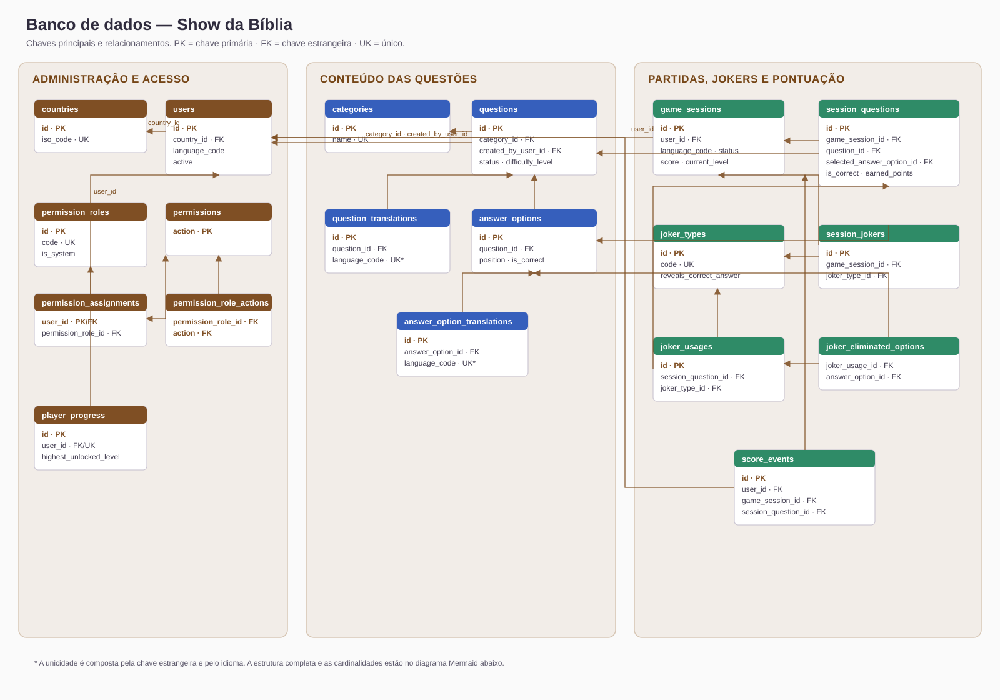
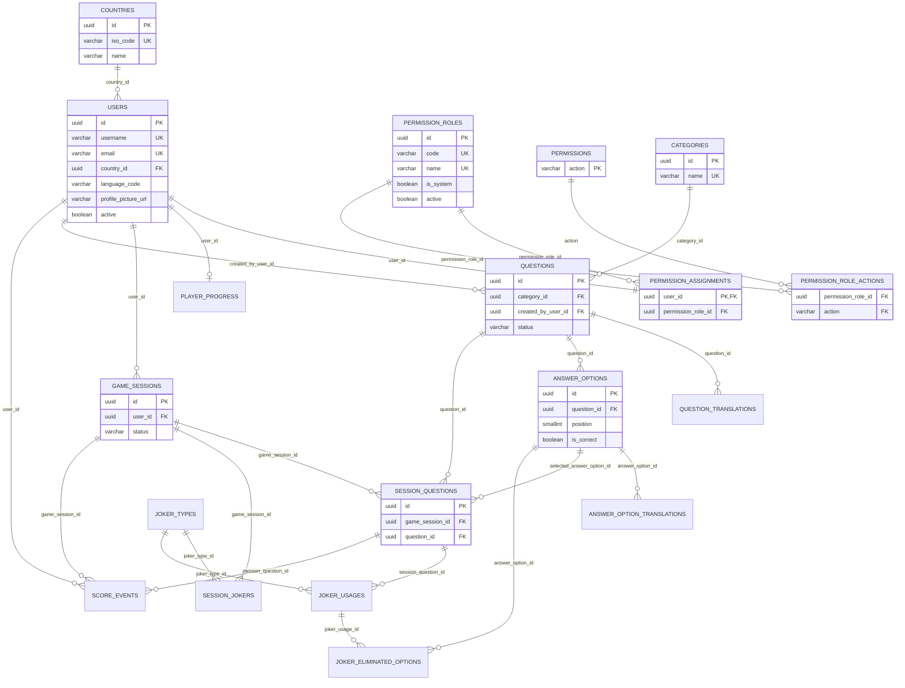

# Arquitetura do projeto — Show da Bíblia

## Objetivo

Este documento registra a organização de pastas e o modelo de dados atual do
Show da Bíblia. Deve ser consultado antes de criar domínios, rotas, telas,
models, migrations ou recursos de autorização.

## Estrutura de pastas

```text
show-da-biblia/
├── apps/
│   ├── manager_api/
│   │   └── src/
│   │       ├── controllers/       # Adaptadores HTTP por domínio
│   │       ├── permissions/       # Ações exigidas por rota
│   │       ├── plugins/           # Swagger e integrações da API
│   │       ├── routes/            # Registro de endpoints Fastify
│   │       └── types/             # Extensões dos tipos Fastify/JWT
│   ├── web/
│   │   └── src/
│   │       ├── assets/
│   │       │   ├── images/
│   │       │   │   ├── avatars/
│   │       │   │   ├── brand/
│   │       │   │   ├── cards/
│   │       │   │   ├── icons/payments/
│   │       │   │   ├── illustrations/
│   │       │   │   ├── misc/
│   │       │   │   ├── pages/
│   │       │   │   └── svg/
│   │       │   └── styles/variables/
│   │       ├── components/        # Componentes por domínio
│   │       ├── composables/       # Estado e acesso HTTP reutilizável
│   │       ├── layouts/           # Estrutura visual compartilhada
│   │       ├── navigation/        # Itens vertical e horizontal
│   │       ├── pages/             # Páginas de negócio
│   │       ├── plugins/i18n/      # Configuração e traduções web
│   │       ├── types/             # Contratos TypeScript
│   │       └── utils/             # Funções puras e formatadores
│   └── mobile/
├── packages/
│   ├── common/                    # Enums, tipos e funções comuns
│   ├── config/                    # Leitura e validação de ambiente
│   ├── interfaces/                # Interfaces de entrada compartilhadas
│   ├── middlewares/               # JWT e autorização
│   ├── models/                    # Definição Drizzle das tabelas
│   ├── plugins/                   # Banco, i18n, S3, CORS e multipart
│   ├── repositories/              # Persistência por domínio
│   ├── schema/                    # Contratos Fastify e Swagger
│   ├── services/                  # Regras reutilizáveis de domínio
│   └── useCases/                  # Casos de uso por operação
├── atlas/
│   ├── prod/                      # Migrations de estrutura
│   └── seed/dev/                  # Dados de desenvolvimento
└── docs/
```

## Fluxo de uma rota

```text
Web Page/Component
        │
        ▼
Composable → /api/v1/... → Route → Controller → Use case → Service/Repository → Banco
                                      │
                                      ├── Schema Fastify/Swagger
                                      └── Middleware de permissão
```

As interfaces ficam em `packages/interfaces`; schemas em
`packages/schema`; mensagens visíveis devem estar nos arquivos de tradução
`pt`, `en` e `es` do backend e do web.

## Modelo de dados

### Visão visual

O diagrama abaixo é uma visão estática do banco. As setas apontam da tabela
filha (que guarda a chave estrangeira) para a tabela referenciada. Ele pode ser
aberto diretamente em qualquer navegador, sem depender de suporte a Mermaid.



### Diagrama detalhado (Mermaid)



Cada questão publicada possui exatamente quatro alternativas, nas posições de
1 a 4, e somente uma delas deve ter `is_correct` como verdadeiro.

## Permissões

O acesso não depende de `ADMIN` ou `PLAYER` fixos no usuário. Cada usuário
possui uma atribuição em `permission_assignments`, vinculada a um papel em
`permission_roles`. As ações do papel são definidas por
`permission_role_actions`.

Catálogo inicial:

- `dashboard.view`
- `users.view`, `users.create`, `users.update`, `users.delete`
- `roles.view`, `roles.create`, `roles.update`, `roles.delete`,
  `roles.permissions`

Os papéis de sistema são Administrador e Jogador. Eles são protegidos contra
remoção e alteração.

## Cadastro de usuário, país e foto

Todo usuário possui obrigatoriamente um `country_id`, chave estrangeira para
`countries.id`, e um `language_code`, que define o idioma do jogo (`pt-BR`,
`en` ou `es`). O país representa a origem do usuário e não o idioma escolhido.

O Manager API disponibiliza `GET /api/v1/countries` para carregar somente os
países ativos no formulário administrativo. Criação e atualização validam que o
país informado existe e está ativo.

A foto é opcional e é recebida no campo multipart `profile_picture`. O backend
aceita JPEG, PNG, WEBP e GIF, com limite de 5 MB, armazena o objeto no MinIO em
`users/profile-pictures/<uuid-v7>.<extensão>` e salva apenas a URL pública em
`users.profile_picture_url`. Ao substituir ou excluir um usuário, o objeto
anterior é removido do MinIO.

## UUIDs e migrations

Todos os identificadores criados pela aplicação devem usar UUID v7, por meio de
`createUuidV7()` em `packages/common/functions/uuid.ts`. Seeds também devem
usar UUID v7 estático válido. Nunca introduzir `uuid.v4` ou
`gen_random_uuid()` em novos models, repositórios ou seeds.

Após alterar a estrutura:

```bash
pnpm migrate:local
# Para recriar a base local e reaplicar seeds:
pnpm seed:local
```

---

Documentação Show da Biblia — Arquitetura e banco de dados
